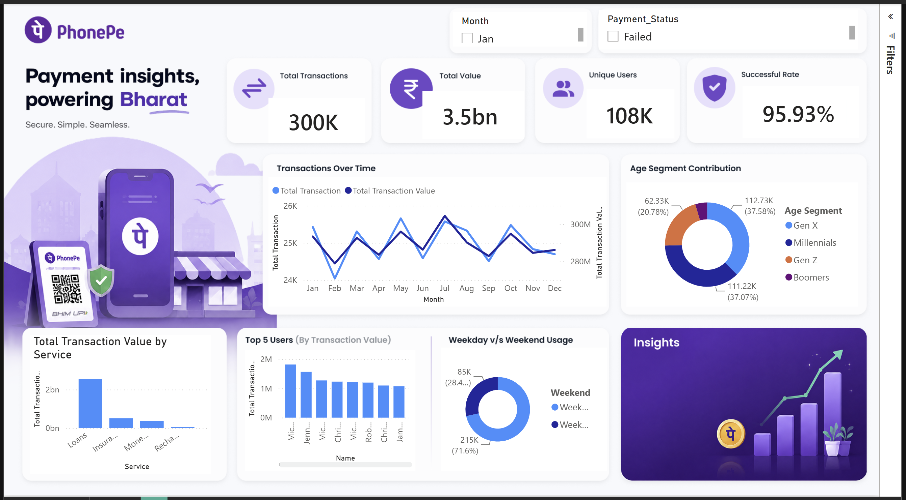

# 📊 PhonePe Transaction Analysis Dashboard

## 📌 Project Overview

This project presents an interactive **Power BI Dashboard** built to analyze PhonePe transaction and user data. The dashboard provides insights into transaction performance, user demographics, payment success rates, and monthly trends using interactive visualizations.

The report enables users to monitor key business metrics and identify patterns that support data-driven decision making.

---

## 🚀 Features

- 📈 Total Transaction Value
- 💳 Total Transactions
- 👥 Total Users
- ✅ Transaction Success Rate
- 📅 Monthly Transaction Trends
- 📊 Transaction Value by Category
- 👤 User Distribution by State
- 🍩 Payment Status Distribution
- 🎯 User Age Segment Analysis
- 🔍 Interactive Filters (Month & Payment Status)

---

## 📊 Dashboard KPIs

The dashboard tracks important business metrics including:

- Total Transaction Value
- Total Number of Transactions
- Total Registered Users
- Transaction Success Rate

---

## 📈 Visualizations

The dashboard includes:

- KPI Cards
- Column Charts
- Line Chart
- Donut Charts
- Interactive Slicers
- Dynamic Filtering

---

## 🛠️ Tools & Technologies

- **Power BI Desktop**
- Power Query
- DAX (Data Analysis Expressions)
- Data Modeling

---

## 📂 Dataset

The dashboard is built using transaction and user datasets containing information such as:

- Transaction Details
- Transaction Value
- Payment Status
- User Information
- Age Segments
- Monthly Data

---

## 📌 Key Insights

- Monitor monthly transaction performance.
- Analyze transaction value trends.
- Evaluate payment success rate.
- Understand user demographic distribution.
- Compare transaction activity across different categories.

---

## 📸 Dashboard Preview

images/dashboard.png

---

## ▶️ How to Use

1. Download the repository.
2. Open **Phonepe_Dashboard.pbix** in Power BI Desktop.
3. Refresh the dataset if required.
4. Interact with filters and visuals to explore insights.

---

